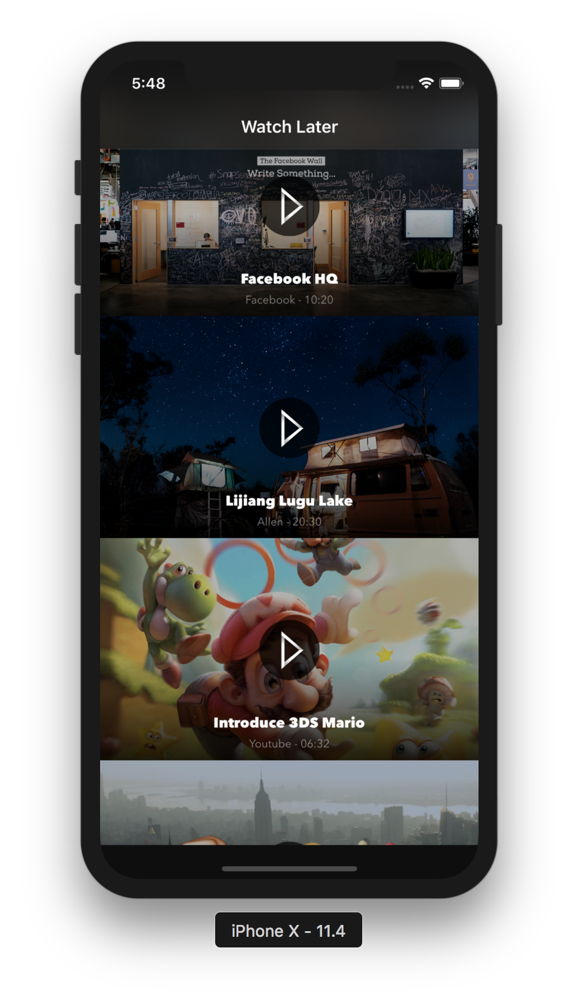

# PlayLocalVideo
## 文件结构
```Shell
.
├── .DS_Store
├── .git
│   ├── HEAD
│   ├── branches
│   ├── config
│   ├── description
│   ├── hooks
│   │   ├── applypatch-msg.sample
│   │   ├── commit-msg.sample
│   │   ├── fsmonitor-watchman.sample
│   │   ├── post-update.sample
│   │   ├── pre-applypatch.sample
│   │   ├── pre-commit.sample
│   │   ├── pre-push.sample
│   │   ├── pre-rebase.sample
│   │   ├── pre-receive.sample
│   │   ├── prepare-commit-msg.sample
│   │   └── update.sample
│   ├── info
│   │   └── exclude
│   ├── objects
│   │   ├── info
│   │   └── pack
│   └── refs
│       ├── heads
│       └── tags
├── .idea
│   ├── PlayLocalVideo.iml
│   ├── inspectionProfiles
│   │   └── profiles_settings.xml
│   ├── misc.xml
│   ├── modules.xml
│   └── workspace.xml
├── PlayLocalVideo
│   ├── .DS_Store
│   ├── AppDelegate.swift
│   ├── Assets.xcassets
│   │   ├── .DS_Store
│   │   ├── AppIcon.appiconset
│   │   │   ├── 120-1.jpg
│   │   │   ├── 120.jpg
│   │   │   ├── 180.jpg
│   │   │   ├── 23690717\ 2\ 2-1.jpg
│   │   │   ├── 23690717\ 2\ 2.jpg
│   │   │   ├── 80.jpg
│   │   │   ├── 87.jpg
│   │   │   ├── Contents.json
│   │   │   └── icon.jpg
│   │   ├── Contents.json
│   │   ├── Videos
│   │   │   ├── .DS_Store
│   │   │   ├── Adventure\ Time.mp4
│   │   │   ├── Emoji\ Among\ Us.mp4
│   │   │   ├── Facebook\ HQ.mp4
│   │   │   ├── Introduce\ 3DS\ Mario.mp4
│   │   │   ├── Lijiang\ Lugu\ Lake.mp4
│   │   │   └── Seals\ Documentary.mp4
│   │   ├── playBtn.imageset
│   │   │   ├── Contents.json
│   │   │   ├── playBtn.png
│   │   │   ├── playBtn@2x.png
│   │   │   └── playBtn@3x.png
│   │   ├── videoScreenshot01.imageset
│   │   │   ├── Contents.json
│   │   │   ├── videoScreenshot01.png
│   │   │   ├── videoScreenshot01@2x.png
│   │   │   └── videoScreenshot01@3x.png
│   │   ├── videoScreenshot02.imageset
│   │   │   ├── Contents.json
│   │   │   ├── videoScreenshot02.png
│   │   │   ├── videoScreenshot02@2x.png
│   │   │   └── videoScreenshot02@3x.png
│   │   ├── videoScreenshot03.imageset
│   │   │   ├── Contents.json
│   │   │   ├── videoScreenshot03.png
│   │   │   ├── videoScreenshot03@2x.png
│   │   │   └── videoScreenshot03@3x.png
│   │   ├── videoScreenshot04.imageset
│   │   │   ├── Contents.json
│   │   │   ├── videoScreenshot04.png
│   │   │   ├── videoScreenshot04@2x.png
│   │   │   └── videoScreenshot04@3x.png
│   │   ├── videoScreenshot05.imageset
│   │   │   ├── Contents.json
│   │   │   ├── videoScreenshot05.png
│   │   │   ├── videoScreenshot05@2x.png
│   │   │   └── videoScreenshot05@3x.png
│   │   └── videoScreenshot06.imageset
│   │       ├── Contents.json
│   │       ├── videoScreenshot06.png
│   │       ├── videoScreenshot06@2x.png
│   │       └── videoScreenshot06@3x.png
│   ├── Base.lproj
│   │   ├── LaunchScreen.storyboard
│   │   └── Main.storyboard
│   ├── Info.plist
│   ├── PlayLocalVideo.xcdatamodeld
│   │   ├── .xccurrentversion
│   │   └── PlayLocalVideo.xcdatamodel
│   │       └── contents
│   ├── VideoCell.swift
│   └── ViewController.swift
├── PlayLocalVideo.xcodeproj
│   ├── project.pbxproj
│   ├── project.xcworkspace
│   │   ├── contents.xcworkspacedata
│   │   ├── xcshareddata
│   │   │   └── IDEWorkspaceChecks.plist
│   │   └── xcuserdata
│   │       └── lightwingng.xcuserdatad
│   │           └── UserInterfaceState.xcuserstate
│   └── xcuserdata
│       └── lightwingng.xcuserdatad
│           └── xcschemes
│               └── xcschememanagement.plist
├── PlayLocalVideoUITests
│   ├── Info.plist
│   └── PlayLocalVideoUITests.swift
├── README.md
└── demo.png
```

